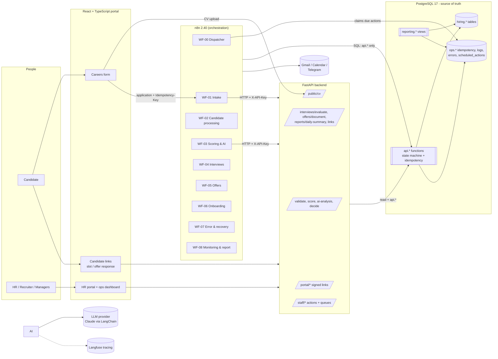
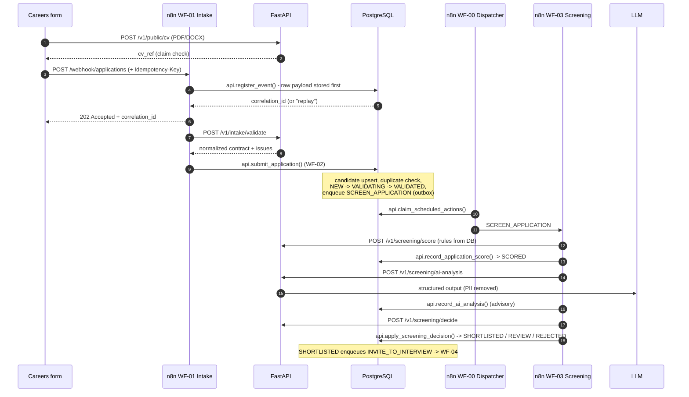

# Architecture

NovaTech Hiring Automation takes a job application from submission to an onboarded employee. It is built so
that a failure at any point is visible, recoverable and never creates duplicate business records.

## 1. Guiding rule: each tool does the job it is best at

| Question | Owner | Why |
|---|---|---|
| Must this rule never break, even when a workflow has a bug? | **PostgreSQL** | Constraints, the state machine and idempotency live in the database, so no caller can bypass them. |
| Does it talk to an outside app, involve time, or coordinate steps? | **n8n** | Webhooks, email/calendar/chat, schedules, retries, human hand-offs, orchestration. |
| Does it need types, unit tests or libraries (parsing, AI, PDF)? | **FastAPI** | Pydantic contracts, pytest, LangChain, document parsing. Endpoints are pure computations. |
| Does a person look at it or click it? | **React + TypeScript** (`frontend/`) | Careers form, candidate links, HR portal, operations dashboard. |

Two consequences:

* **n8n workflows are short-lived.** State lives in the database, not in paused executions. Multi-day waits are
  rows in `ops.scheduled_actions`, picked up by a dispatcher (durable timers).
* **Backend compute endpoints never write.** n8n calls them, then persists the result through `api.*`
  database functions. This keeps the orchestration visible in n8n, and it makes the endpoints safe to retry.
* **People act through the backend, never through n8n.** A candidate's slot choice, an interviewer's scorecard or an
  approver's decision is one `api.*` call with that person as the actor (`/v1/portal/*` with a signed link, or
  `/v1/staff/*`). The database checks ownership, roles and state; the backend then kicks the dispatcher so n8n
  continues the process within seconds.

## 2. System context

## 3. How one application flows

## 4. Reliability building blocks

| Concern | Mechanism | Where |
|---|---|---|
| Never drop a submission | Raw payload persisted before processing (`ops.processed_events`) | `api.register_event` |
| Replayed webhook | Unique `(source, idempotency_key)`; completed events return the stored result | `api.register_event`, `api.submit_application` |
| Duplicate candidate/application | Unique normalized email; one *active* application per candidate and position | partial unique indexes |
| Duplicate offer / employee / booking | One open offer per application; one employee per offer; one booking per slot | partial unique indexes |
| Duplicate emails on replay | `ops.notifications` with a unique dedupe key | `api.begin_notification` |
| Invalid status jumps | Transitions table + actor types + managed transitions; status column guarded by a trigger | `hiring.transition_application` |
| Lost hand-offs between steps | Transactional outbox: status changes enqueue follow-up actions in the same transaction | `on_enter_action` + `ops.scheduled_actions` |
| Reminders that fire after the fact | Timers are rows; replying cancels them; handlers re-check state; stale callers get `STALE_STATE` | `api.cancel_scheduled_actions`, `p_expected_from` |
| Transient failures | Classified errors (`retryable` flag), bounded exponential backoff | backend problem+json, n8n `SWF-01`, `api.complete_scheduled_action` |
| Permanent failures | Dead/error queue with original payload and replay target | `ops.automation_errors`, WF-07 |
| Traceability | Correlation id on every event, history row, log, error, AI trace | `reporting.trace(correlation_id)` |

Details: [reliability.md](reliability.md) · Data model: [database.md](database.md) ·
State machine: [state-machine.md](state-machine.md) · Workflows: [workflows.md](workflows.md)

## 5. AI: narrow and advisory

* One structured call (LangChain `with_structured_output`, native JSON schema). **No agent loop, no tools, no RAG.**
  The applicant controls the input, so a tool-using agent would be a prompt-injection risk. There is also no
  retrieval problem in screening.
* The input is PII-minimised: name, email, phone, national ID, links and personal details are removed.
  The prompt fences application content as untrusted data.
* The output is validated in our own code: shape, 0-10 ranges, enum values and lengths. Database CHECK
  constraints validate it again. One corrective retry, then `FALLBACK`, which routes the candidate to manual review.
* **AI never decides.** The configured rules decide the route. AI can only add a human review, never remove
  one. The database rejects `AI` as an actor for any transition.
* Refusals and provider outages are handled explicitly: a refusal becomes a fallback, and an outage returns a
  retryable 503.

## 6. Deployment model

Single-tenant: one installation per company, run with `docker compose`.

| Container | Image | Exposure |
|---|---|---|
| `db` | postgres:17-alpine (business data) | localhost:5433 |
| `migrate` / `seed` | dbmate 2.36 / postgres (run once, exit) | none |
| `backend` | built from `backend/Dockerfile` (non-root) | localhost:8000 |
| `n8n` | n8nio/n8n:2.40.7 | localhost:5678 |
| `n8n-runners` | n8nio/runners:2.40.7 (external task runners) | internal |
| `n8n-db` | postgres:17-alpine (n8n's own state) | internal |
| `portal` | built from `frontend/Dockerfile` (nginx-unprivileged) | localhost:5173 |
| `mailpit` | axllent/mailpit (development inbox) | localhost:8025 |

For production, put a reverse proxy (Caddy/Traefik/nginx) with TLS in front. Expose only `/webhook/*`
and the portal publicly, and keep the n8n editor behind VPN or SSO. Set `N8N_SECURE_COOKIE=true` and
`APP_ENV=production`, and use a managed Postgres with point-in-time recovery.

**Licensing note.** n8n is distributed under the Sustainable Use License. A company running its own
instance for internal use is covered, and building or configuring it for them is a service. Hosting one
n8n for many paying companies as your own SaaS needs a commercial agreement with n8n.

## 7. Security model

* Three database roles:
  * `novatech_owner` owns the objects and is used only by migrations.
  * `n8n_app` and `backend_app` can `SELECT` and `EXECUTE api.*`, and nothing else.
* Every `api.*` function is `SECURITY DEFINER` with a pinned `search_path`. Audit tables are append-only (trigger).
* Service-to-service calls (n8n to the backend, and the backend to n8n's `ops/*` webhooks) use rotatable
  `X-API-Key` keys, compared in constant time.
* Candidates, interviewers and approvers act through **signed, expiring links** (HS256 JWT, `LINK_SIGNING_SECRET`):
  each token names one person, one entity and one purpose, expires with the business deadline, and travels in the
  URL fragment so it never reaches server logs. The database still checks ownership and state on every action.
* Staff sign in to the portal **without passwords**: `POST /v1/auth/staff/login-link` emails a single-use, 15-minute
  link (the response never reveals whether an address exists; one link per minute per address); the portal
  exchanges it once (`api.consume_link_token`) for an 8-hour session token. Sign-ins and refused re-use are audited
  against the staff member. A company with an identity provider can swap the email step for OIDC; the session and
  everything after it stay the same.
* Internal tools can call `/v1/staff/*` server-side with the service key plus `X-Staff-Id`. Either way the database
  re-checks that the staff member is active and allowed to act.
* The portal is served by unprivileged nginx with a Content-Security-Policy, `no-referrer`, `nosniff` and frame
  denial; link tokens are read from the URL fragment and removed from the address bar on load.
* Secrets live only in `.env` / n8n credentials. The backend container receives only the variables it needs.
* All ports are bound to `127.0.0.1`. CV uploads are type-checked by magic bytes and size-limited, with a
  zip-bomb guard.
* Fault injection (for failure demos) is forced off when `APP_ENV=production`.
