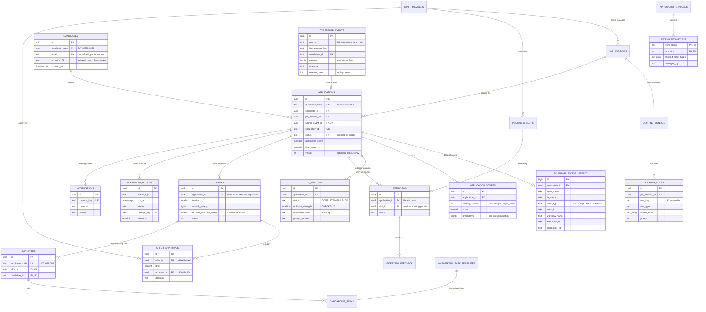

# Database design

PostgreSQL 17 (Supabase-compatible, plain Postgres features only). Migrations live in [`db/migrations`](../db/migrations)
and are applied with [dbmate](https://github.com/amacneil/dbmate). Configuration seeds are in [`db/seed`](../db/seed).

## Schemas

| Schema | Contents | Runtime access (`n8n_app`, `backend_app`) |
|---|---|---|
| `hiring` | Business domain: candidates, applications, interviews, offers, employees, configuration | `SELECT` only |
| `ops` | Automation infrastructure: processed events, executions, audit log, error queue, scheduled actions, notifications, reports | `SELECT` only |
| `api` | `SECURITY DEFINER` write functions: the **only** way to change data | `EXECUTE` |
| `reporting` | Views and functions for the dashboard, daily report and tracing | `SELECT` / `EXECUTE` |

## Entity relationship diagram

Operational tables without foreign keys to the domain (by design, so they can log anything):
`ops.workflow_executions`, `ops.automation_logs` (append-only), `ops.automation_errors` (dead/error queue),
`ops.daily_reports`, `ops.code_counters`.

## Brief table mapping

| Brief | Table |
|---|---|
| Candidates | `hiring.candidates` |
| JobPositions | `hiring.job_positions` |
| Applications | `hiring.applications` |
| CandidateStatusHistory | `hiring.candidate_status_history` |
| ScoringRules | `hiring.scoring_rules` + `hiring.scoring_configs` (thresholds, version) |
| Interviews | `hiring.interviews` + `hiring.interview_slots` |
| InterviewFeedback | `hiring.interview_feedback` |
| Offers | `hiring.offers` |
| OfferApprovals | `hiring.offer_approvals` |
| Employees | `hiring.employees` |
| OnboardingTasks | `hiring.onboarding_tasks` + `hiring.onboarding_task_templates` |
| ProcessedEvents / IdempotencyKeys | `ops.processed_events` |
| WorkflowExecutions | `ops.workflow_executions` |
| AutomationLogs | `ops.automation_logs` |
| AutomationErrors | `ops.automation_errors` |
| (added) | `hiring.settings`, `hiring.skill_aliases`, `hiring.application_statuses`, `hiring.status_transitions`, `hiring.ai_analyses`, `hiring.application_scores`, `ops.scheduled_actions`, `ops.notifications`, `ops.daily_reports` |

## Constraints that carry business rules

| Rule | Enforcement |
|---|---|
| One active application per candidate and position | `applications_one_active_per_position_uq` (partial unique, excludes closed statuses) |
| An event is processed once | `processed_events_idempotency_uq (source, idempotency_key)` |
| One open offer per application | `offers_one_open_per_application_uq` (partial unique) |
| One employee per offer / candidate / application | `employees.offer_id`, `candidate_id`, `application_id` unique |
| One booking per interview slot; no overlapping slots | `interviews_one_booking_per_slot_uq`, `interview_slots_no_overlap` (GiST exclusion) |
| One interview per application round | `interviews_round_uq (application_id, round)` |
| One approval per level; an approver approves only once per offer | `offer_approvals_level_uq`, `offer_approvals_approver_uq` |
| A rejection needs a reason | `offer_approvals` CHECK |
| AI scores within 0-10 | `ai_analyses` CHECKs |
| Status changes only through the state machine | `applications_status_guard` trigger |
| History, audit log and approvals cannot be edited | `ops.forbid_mutation()` append-only triggers |
| Configuration values are well-typed | `settings_validate` trigger |
| Rule edits are versioned | `scoring_rules_bump_version`, `scoring_configs_bump_version` triggers |

## Identifiers

Internal primary keys are UUIDs. Human-readable business codes come from `ops.next_code()`, which uses a
per-scope counter row, so they are gap-free under normal operation and safe under concurrency:
`CAN-2026-0001`, `APP-2026-00001`, `NT-2026-001`, `COR-20260929-0001`. They are never computed in n8n.

## Write API (`api` schema)

Every function takes `p_ctx jsonb`: `{actor_type, actor_id, correlation_id, workflow_name, workflow_version, execution_id, retry_count}`.

| Function | Purpose | Idempotent |
|---|---|---|
| `register_event(source, key, type, payload, ctx)` | Store an inbound event first; detect replays | yes |
| `fail_event(event_id, reason, ctx)` | Mark an event FAILED (infrastructure error) | yes |
| `submit_application(event_id, validation, ctx)` | Candidate upsert, duplicate check, create application | yes (by event) |
| `record_application_score(app_id, score, ctx)` | Store the rule score, VALIDATED -> SCORED | yes (version + input hash) |
| `record_ai_analysis(app_id, analysis, ctx)` | Store advisory AI output; upgrade FALLBACK -> COMPLETED | yes |
| `apply_screening_decision(app_id, decision, ctx)` | SCORED -> SHORTLISTED / SCREENING_REVIEW / REJECTED | yes |
| `transition_application_status(app_id, to, reason, ctx, expected_from)` | Human decisions (review queues, closing) | yes |
| `application_snapshot(app_id)` | Current state + candidate + position, for templating and state re-checks | read |
| `schedule_action / cancel_scheduled_actions / claim_scheduled_actions / complete_scheduled_action / requeue_scheduled_action` | Durable timers + outbox | yes |
| `begin_notification / finish_notification` | Send each message at most once per dedupe key | yes |
| `start_workflow_execution / finish_workflow_execution` | Execution tracking | yes |
| `record_error / begin_error_replay / resolve_error` | Dead/error queue and safe replay | yes (fingerprint) |
| `log_action(ctx, entity, id, action, outcome, details)` | Audit log entries from workflows | append |
| `save_daily_report / mark_daily_report_delivered` | Daily report, sent once per date | yes |

Interview, offer and onboarding functions (`create_interview_invitation`, `confirm_interview_slot`,
`submit_interview_feedback`, `apply_interview_decision`, `create_offer`, `decide_offer_approval`,
`mark_offer_sent`, `respond_to_offer`, `expire_offer`, `create_employee_from_offer`,
`complete_onboarding_task`, `withdraw_application`) are part of build step 2. Their managed transitions are
already declared in `hiring.status_transitions`.

## Reporting

| Object | Use |
|---|---|
| `reporting.daily_metrics(date)` | Every number in the daily management report (flow + stock metrics) |
| `reporting.v_ops_overview` | One-row health summary for the dashboard |
| `reporting.v_pipeline_by_status` | Funnel by status |
| `reporting.v_manual_review_queue` | Screening / interview reviews waiting for a human |
| `reporting.v_pending_offer_approvals` | Offers waiting for L1/L2 |
| `reporting.v_pending_interview_feedback` | Interviews finished without feedback |
| `reporting.v_open_offers` | Sent / negotiating / expired offers |
| `reporting.v_overdue_onboarding_tasks` | Overdue onboarding tasks |
| `reporting.v_error_queue` | Open / replaying errors |
| `reporting.v_scheduled_actions` | Pending, running and failed timers |
| `reporting.v_workflow_health_today` | Runs, failures, average and p95 duration per workflow |
| `reporting.trace(correlation_id)` | End-to-end trace of one business transaction |
