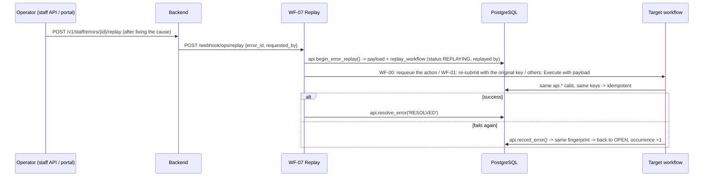

# Reliability: idempotency, retries, error queue and replay

## 1. Idempotency strategy

Delivery is **at-least-once** everywhere (webhooks get retried, n8n retries, operators replay). Correctness therefore
comes from making every effect idempotent, in four layers:

| Layer | Question | Mechanism |
|---|---|---|
| **Event** | "Have I seen this exact request?" | Client-generated `Idempotency-Key` (the form creates a UUID per submission and reuses it on retry). `ops.processed_events` is unique on `(source, idempotency_key)`, and the payload hash must match (otherwise `IDEMPOTENCY_KEY_REUSED`). A completed event returns its stored result. |
| **Business entity** | "Is this the same person or application?" | Normalised email is the candidate identity (unique). A phone match on a different email is **flagged for review, never merged**. One active application per candidate and position (partial unique index) gives the `DUPLICATE` outcome. |
| **Step** | "Did this step already run?" | Scores are unique on `(application, scoring_version, input_hash)`. AI analyses are unique on `(application, prompt_version, input_hash)`. Interviews are unique on `(application, round)`. Offers allow one open offer per application. Employees are unique on `offer_id`. Approvals are unique on `(offer, level)`. Transitions to the current status are no-ops. |
| **Side effect** | "Did we already email them?" | `ops.notifications` unique on `dedupe_key` (e.g. `ack:<event_id>`, `interview.invite:<interview_id>`). `begin_notification` returns `should_send = false` once a message is `SENT`. Scheduled actions are unique on `dedupe_key`. |

A send that succeeds at the provider but crashes before `finish_notification` can, rarely, be re-sent.
That is the unavoidable at-least-once window, and it is documented rather than hidden.

**Demonstration (scenario 4).** Post the same body with the same `Idempotency-Key` twice. The second call
returns the same `correlation_id`, `receive_count` becomes 2, `EVENT_REPLAY_DETECTED` is logged, and no second
candidate, application or email exists. This is covered by the integration test
`test_replaying_the_same_event_creates_no_duplicate_records`.

## 2. Error classification

Every backend error is RFC 9457 `application/problem+json` with a stable `code` and a `retryable` flag:

| Class | Examples | HTTP | Handling |
|---|---|---|---|
| Retryable | timeout, connection error, 429, 5xx, DB deadlock/serialization, LLM provider outage | 503 (+ `Retry-After`) | bounded retry with backoff |
| Non-retryable | invalid payload, auth failure, unknown model, business rule (`INVALID_TRANSITION`, `STALE_STATE`, …) | 400/401/403/404/409/422/502 | straight to the error queue |
| Content failure | AI malformed/invalid/refused | 200 with `status: FALLBACK` | handled in-band: route to manual review |

Database business errors use SQLSTATE class `NT` (`NT400` … `NT422`, message `CODE: detail`). The backend maps
them to HTTP automatically. n8n sees the same codes when it calls `api.*` directly.

## 3. Retry policy

| Where | Policy |
|---|---|
| n8n → backend (SWF-01) | max 3 attempts, exponential backoff 2 s, 4 s; only for retryable results. Each attempt is logged (`RETRY_ATTEMPT`), and a success after a retry is logged (`RETRY_RECOVERED`). |
| Backend → LLM | SDK `max_retries=1` for transport blips, then 503 to the orchestrator; exactly **one** corrective retry for invalid output, then `FALLBACK`. No unbounded loops. |
| Scheduled actions (WF-00) | `complete_scheduled_action('FAILED')` reschedules with backoff 30 s · 2^(attempt-1), capped at 1 h, until `max_attempts` (default 5); then `FAILED` + error queue. Crashed workers' leases expire and are re-claimed. |
| Messages (SWF-02) | node-level retry (3) for the provider call, protected by the notification dedupe key |

## 4. Dead / error queue

`ops.automation_errors` stores, per failure:
* correlation id, workflow and version, execution id, node, entity
* error class and code, message, HTTP status, retry count
* the **original payload** and the **replay workflow**

The same failure reported twice (explicit handler + Error Trigger) collapses into one open item
(`fingerprint`, `occurrence_count`).

Surfacing:
* `reporting.v_error_queue` (also `GET /v1/staff/queues/errors`)
* `manual_intervention_required` in the daily metrics and report
* an error digest email to `ops.alert_email` every 5 minutes (WF-07); `alerted_at` guarantees each error is
  alerted once

## 5. Safe replay

Replay cannot duplicate anything because it reuses the original idempotency key and entity ids, and every step
on the path is idempotent (section 1). A `REPLAYING` item whose replay crashed becomes replayable again after
10 minutes. The HTTP response tells the operator whether the replay resolved the item or it is open again.

**Verified:** a `NOTIFY_REVIEW_QUEUE` action that exhausted its 5 attempts (no handler deployed yet) was replayed
after WF-08 went live: the action was requeued, the dispatcher ran it, the recruiters got exactly one email and
the error was `RESOLVED` with the staff member recorded as `resolved_by`.

## 6. Timers (reminders, expiries) without fragile waits

Multi-day `Wait` nodes are avoided. They create long-lived paused executions that are hard to cancel and invisible
to operations. Instead:

1. The step that starts a clock inserts rows into `ops.scheduled_actions`, for example on offer sent:
   `OFFER_REMINDER` at +2 d, `OFFER_FINAL_REMINDER` at +4 d, `OFFER_EXPIRY` at +5 d. The delays come from
   `hiring.settings`.
2. WF-00 claims due rows every minute.
3. The handler **re-checks the current state** first. If the candidate already answered, it completes the
   action as `SKIPPED`.
4. The event that stops the clock (a reply, a confirmation) cancels the pending rows **in the same transaction**
   (`CANCELLED`, with a reason). Closing an application cancels all its timers.

For demos, `DEMO_FAST_TIMERS=true` compresses days to minutes without changing any workflow.

## 7. Fault injection (demonstrating failures deterministically)

Dev/test only: the backend honours it only with `FAULT_INJECTION_ENABLED=true` (forced off in production), and
the workflows only carry it across steps when the database setting `dev.fault_injection_enabled` is true.
The caller sends `X-Fault-Inject: <target>:<mode>[@n]`; SWF-01 adds `X-Attempt: <attempt>`.

| Header | Effect | Scenario |
|---|---|---|
| `score:http_503@2` | fails attempts 1-2, succeeds on 3 | 8: retry recovers |
| `score:http_400` | permanent failure | 9: non-retryable → error queue |
| `score:http_503` | fails every attempt | 10: retries exhausted → dead queue |
| `ai:malformed` | model output replaced by invalid JSON | 7: fallback → manual review |
| `ai:timeout` | simulated provider timeout (retryable) | AI outage handling |
| `evaluate:http_503`, `document:http_400`, … | same modes for the interview evaluation and offer letter calls | failure handling in WF-04 / WF-05 |

Targets: `validate`, `cv`, `score`, `ai`, `decide`, `evaluate`, `document`. Faults are driven by the attempt number,
so they are stateless and behave the same across workers and replays.

**Carrying a fault across asynchronous steps.** The header arrives with the application (WF-01), but scoring runs
later in WF-03, started by the dispatcher. WF-01 therefore stores it as a *test directive* for the correlation id
(`api.set_test_directive`, table `ops.test_directives`); handlers read `api.test_directive(correlation_id)` and pass
it to SWF-01. Clearing the directive (`api.set_test_directive(corr, '')`) and replaying the error proves the
"fixed, replayed, no duplicates" path (scenario 11).
