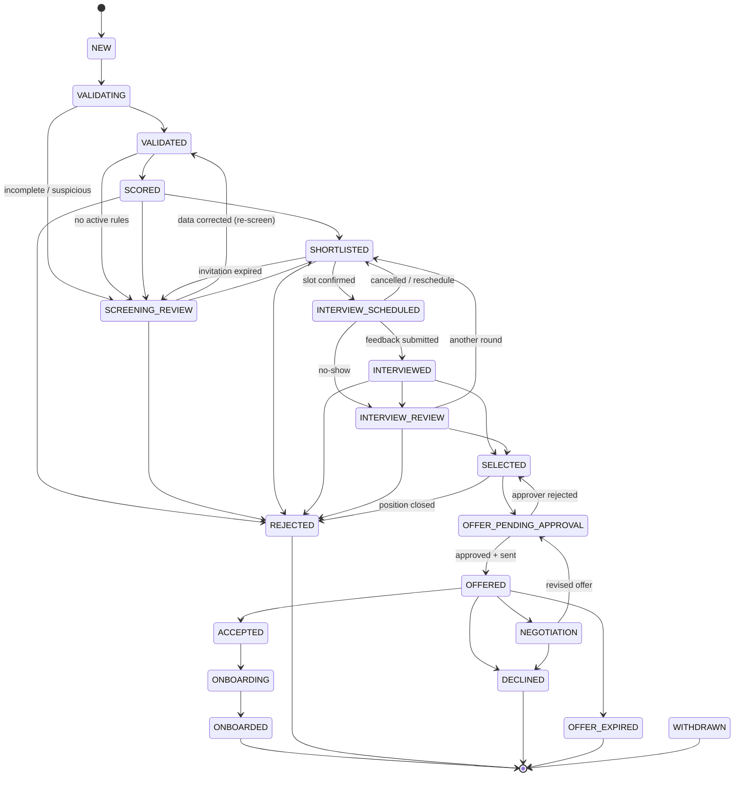

# Candidate / application state machine

The status belongs to the **application** (one person can apply for two positions). The allowed transitions are
**data** in `hiring.status_transitions`, and `hiring.transition_application()` is the only code path that changes
a status. A trigger rejects any other `UPDATE` of `applications.status`, even from a SQL console.

`WITHDRAWN` can be reached from every active post-intake status (candidate withdraws or HR cancels); the
arrows are omitted above for readability.

## Rules enforced on every transition

1. **Allowed pair.** `(from, to)` must exist in `hiring.status_transitions`; otherwise `INVALID_TRANSITION`.
2. **Allowed actor.** `SYSTEM`, `STAFF` or `CANDIDATE` must be listed for that pair; otherwise `ACTOR_NOT_ALLOWED`.
   **`AI` is never accepted as an actor** (`AI_ACTOR_FORBIDDEN`). STAFF actors must be active staff members.
3. **Managed transitions.** Transitions with side effects (booking a slot, sending an offer, creating an employee)
   name their owning function in `managed_by` and are refused elsewhere (`TRANSITION_REQUIRES_FUNCTION`).
4. **Optimistic concurrency.** Callers can pass `expected_from`; if the application has moved on, they get
   `STALE_STATE`. Example: a reminder racing a confirmation.
5. **Idempotent.** Moving to the current status is a no-op (`changed = false`).
6. **Side effects in the same transaction.**
   * A history row and an audit log entry are written.
   * The status's `on_enter_action` is enqueued (outbox).
   * Entering a terminal status cancels pending timers, cancels the application's open interviews (a booked slot
     is free again and the interviewer is told) and withdraws an open offer, so a closed application leaves no
     link that still offers slots or terms.
7. **Human decisions need a reason** (`REASON_REQUIRED`).

## Who may do what

| Transition | Actors | Performed by |
|---|---|---|
| NEW → VALIDATING → VALIDATED / SCREENING_REVIEW | SYSTEM | `api.submit_application` (WF-02) |
| VALIDATED → SCORED | SYSTEM | `api.record_application_score` (WF-03) |
| SCORED → SHORTLISTED / SCREENING_REVIEW / REJECTED | SYSTEM | `api.apply_screening_decision` (WF-03) |
| SCREENING_REVIEW → VALIDATED / SHORTLISTED / REJECTED | STAFF | `api.transition_application_status` (HR portal) |
| SHORTLISTED → INTERVIEW_SCHEDULED | CANDIDATE, STAFF | `api.confirm_interview_slot` |
| SHORTLISTED → SCREENING_REVIEW | SYSTEM | `api.expire_interview_invitation` |
| INTERVIEW_SCHEDULED → INTERVIEWED | STAFF, SYSTEM | `api.submit_interview_feedback` |
| INTERVIEWED → SELECTED / REJECTED / INTERVIEW_REVIEW | SYSTEM, STAFF | `api.apply_interview_decision` (documented formula) |
| INTERVIEW_REVIEW → SELECTED / REJECTED / SHORTLISTED | STAFF | `api.transition_application_status` |
| SELECTED → OFFER_PENDING_APPROVAL | SYSTEM, STAFF | `api.create_offer` |
| OFFER_PENDING_APPROVAL → OFFERED | SYSTEM | `api.mark_offer_sent` (only after all approvals) |
| OFFER_PENDING_APPROVAL → SELECTED | STAFF | `api.decide_offer_approval` (rejection) |
| OFFERED → ACCEPTED / DECLINED / NEGOTIATION | CANDIDATE | `api.respond_to_offer` |
| OFFERED → OFFER_EXPIRED | SYSTEM | `api.expire_offer` |
| ACCEPTED → ONBOARDING | SYSTEM | `api.create_employee_from_offer` |
| ONBOARDING → ONBOARDED | SYSTEM, STAFF | `api.complete_onboarding_task` |
| any active → WITHDRAWN | CANDIDATE, STAFF | `api.withdraw_application` |

## On-enter actions (outbox)

| Entering | Enqueued action | Handled by |
|---|---|---|
| VALIDATED | `SCREEN_APPLICATION` | WF-03 |
| SCREENING_REVIEW, INTERVIEW_REVIEW | `NOTIFY_REVIEW_QUEUE` | WF-08 |
| SHORTLISTED | `INVITE_TO_INTERVIEW` | WF-04 |
| INTERVIEW_SCHEDULED | `FINALIZE_INTERVIEW_BOOKING` | WF-04 |
| INTERVIEWED | `EVALUATE_INTERVIEW` | WF-04 |
| SELECTED | `PREPARE_OFFER` | WF-05 |
| OFFER_PENDING_APPROVAL | `REQUEST_OFFER_APPROVAL` | WF-05 |
| NEGOTIATION | `NOTIFY_NEGOTIATION` | WF-05 |
| ACCEPTED | `START_ONBOARDING` | WF-06 |
| ONBOARDED | `NOTIFY_ONBOARDING_COMPLETE` | WF-06 |
| REJECTED | `SEND_REJECTION_NOTICE` | WF-02 |
| DECLINED, OFFER_EXPIRED | `NOTIFY_OFFER_CLOSED` | WF-05 |

## Deviations from the brief (and why)

The brief invites justified improvements. These were needed to make every mandatory scenario representable:

| Brief | Implementation | Reason |
|---|---|---|
| One `MANUAL_REVIEW` status | `SCREENING_REVIEW` and `INTERVIEW_REVIEW` | Review happens at two stages with different allowed exits. A single status cannot know whether its next step is "shortlist" or "select". |
| No path for incomplete applications | `VALIDATING → SCREENING_REVIEW` | Scenario 2: an incomplete application goes to manual review with a reason. |
| No expiry status | `OFFER_EXPIRED` | Scenario 21: an unanswered offer expires or closes. |
| No approver-rejection path | `OFFER_PENDING_APPROVAL → SELECTED` (offer row becomes `REJECTED_BY_APPROVER`) | Scenario 18: the send path stops and the reason is recorded; HR can revise or close. |
| No revised offer after negotiation | `NEGOTIATION → OFFER_PENDING_APPROVAL` (new offer revision; old one `SUPERSEDED`) | Scenario 20. |
| No withdrawal | `WITHDRAWN` | Candidates drop out in reality; it is terminal and cancels timers. |
| INTERVIEW_SCHEDULED on invite | Stays `SHORTLISTED` while invited; `INTERVIEW_SCHEDULED` once a slot is confirmed | Scenarios 12/13: the "unconfirmed" state must be observable. |

Interviews and offers also have their own small lifecycles (`hiring.interviews.status`, `hiring.offers.status`),
changed only by the same functions that move the application, so the two never disagree.

## What the candidate receives at each step

Every candidate-facing step sends exactly one email (SWF-02 dedupe). `application_statuses.candidate_informed`
marks these steps; `candidate_notice` names the status update WF-02 sends where no other workflow emails the
candidate. Internal steps (validation, scoring, internal reviews, offer approval) send nothing.

| Status | Email to the candidate | Sent by |
|---|---|---|
| (submitted) | We received your application (or: duplicate / could not be processed) | WF-02 intake |
| SCREENING_REVIEW | Your application is being reviewed (or: your interview invitation expired and is back with a recruiter) | WF-02 `NOTIFY_CANDIDATE` |
| SHORTLISTED | Interview invitation with a personal link to choose a slot (+ one reminder) | WF-04 |
| INTERVIEW_SCHEDULED | Interview confirmed: time, place, add-to-calendar | WF-04 |
| INTERVIEWED | Thank you for interviewing; a decision follows | WF-02 `NOTIFY_CANDIDATE` |
| SELECTED | Good news: you have been selected, the written offer is being prepared | WF-02 `NOTIFY_CANDIDATE` |
| OFFERED | The offer with its letter (PDF) and a personal link to accept, decline or negotiate (+ reminders) | WF-05 |
| NEGOTIATION | We received your message about your offer | WF-05 |
| ACCEPTED → ONBOARDING | Welcome email with the first day and orientation | WF-06 |
| ONBOARDED | Your onboarding is complete | WF-02 `NOTIFY_CANDIDATE` |
| REJECTED | Rejection notice | WF-02 |
| DECLINED / OFFER_EXPIRED | Thank you for letting us know / your offer has expired | WF-05 |
| WITHDRAWN | Confirmation that the application was withdrawn | WF-02 `NOTIFY_CANDIDATE` |
