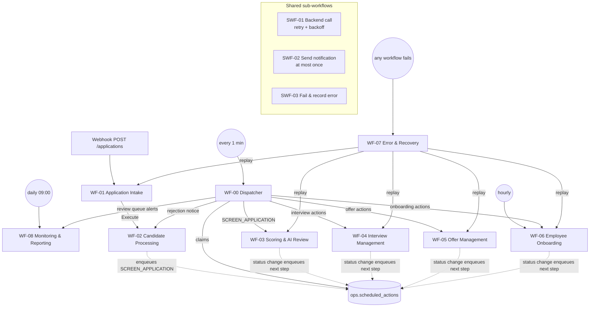

# n8n workflows and responsibilities

Nine workflows plus three reusable sub-workflows. Each one has a single responsibility, is short-lived, and
talks to the database **only** through `api.*` functions (Postgres node, parameterised queries).



## Conventions every workflow follows

1. **Context first.** The first node (Set, "ctx") builds the execution context passed to every `api.*` call:
   ```json
   { "actor_type": "SYSTEM", "actor_id": "n8n", "workflow_name": "WF-03", "workflow_version": "1.0.0",
     "execution_id": "{{ $execution.id }}", "correlation_id": "{{ $json.correlation_id }}" }
   ```
2. **Execution tracking.** The workflow starts with `SELECT api.start_workflow_execution($1::jsonb, 'WEBHOOK'|'SCHEDULE'|'SUB_WORKFLOW'|'REPLAY')`
   and ends with `api.finish_workflow_execution($1::jsonb, 'SUCCEEDED')`. The error branch calls SWF-03, which
   records the error and finishes the execution as `FAILED`.
3. **Settings → Error workflow = WF-07** on every workflow. This is the safety net for unexpected crashes.
4. **Database access.** Use the Postgres node with query parameters (`$1, $2`) and never interpolate
   candidate data into SQL. Use the `NovaTech DB (n8n_app)` credential.
5. **Backend access.** Always go through **SWF-01** (it owns the base URL, auth header, retries, and the
   `X-Correlation-ID` / `X-Attempt` headers).
6. **Messages.** Always go through **SWF-02** with a deterministic dedupe key (e.g. `interview.invite:<interview_id>`).
7. **No business thresholds in IF/Switch nodes.** Branch on values returned by the backend or the database.
   Code nodes stay under about 30 lines; anything larger belongs in the backend.
8. **Delayed work re-checks state.** Timer handlers read `api.application_snapshot()` (or the entity row) first,
   and complete the action as `SKIPPED` if the precondition no longer holds.

## Sub-workflows

### SWF-01 Backend call (retry with exponential backoff)
* **Trigger:** When Executed by Another Workflow. Inputs: `method`, `path`, `body`, `correlation_id`,
  `fault_inject` (optional, tests only), `max_attempts` (default 3), `ctx`.
* **Steps:**
  1. Loop: set `attempt`.
  2. HTTP Request to `http://backend:8000{path}` with header auth `X-API-Key`, headers `X-Correlation-ID`,
     `X-Attempt` and `X-Fault-Inject`. Settings: *Never error*, *Include response status*, timeout 90 s.
  3. Classify the result:
     * 2xx: success.
     * Body `retryable: true`, a 5xx status, or a network/timeout error: retryable.
     * Anything else: permanent.
  4. On a retryable failure with `attempt < max_attempts`: `api.log_action(... 'RETRY_ATTEMPT' ...)`,
     wait `2^attempt` seconds, then loop.
  5. On success with `attempt > 1`: `api.log_action(... 'RETRY_RECOVERED' ...)`.
* **Output:** `{ ok, status, body, attempts, error_class, error_code }`. It never throws, so callers decide
  (fallback, error queue, and so on).

### SWF-02 Send notification (at most once)
* **Inputs:** `dedupe_key`, `channel` (EMAIL | TELEGRAM), `template_key`, `recipient`, `subject`, `body`,
  `application_id`, `entity_type`, `entity_id`, `ctx`.
* **Steps:**
  1. `api.begin_notification(...)`. If `should_send = false`, return (a replay already sent it).
  2. Send via the Gmail or Telegram node (retry on fail: 3).
  3. `api.finish_notification(id, 'SENT'|'FAILED', provider_message_id, error)`.
* Swapping Gmail for Outlook, SES or Slack for another company changes **only this sub-workflow**.

### SWF-03 Fail & record error
* **Inputs:** `ctx`, `node_name`, `error_class`, `error_code`, `error_message`, `http_status`, `retry_count`,
  `entity_type`, `entity_id`, `payload`, `replay_workflow`.
* **Steps:**
  1. `api.record_error(...)`, which dedupes by fingerprint.
  2. `api.finish_workflow_execution(ctx, 'FAILED', error_id)`.
  3. Optional immediate Telegram alert for `NON_RETRYABLE` errors.

## Workflows

### WF-00 Dispatcher & scheduler
| | |
|---|---|
| Responsibility | Deliver outbox events and fire due timers exactly where they belong |
| Triggers | Schedule (every minute) and Execute Workflow ("kick" from other workflows for low latency) |
| Steps | 1. `api.claim_scheduled_actions('n8n-wf00', 25, 300)`<br/>2. Switch on `action_type` → Execute the owning workflow with `{action}`<br/>3. `api.complete_scheduled_action(id, 'DONE'\|'SKIPPED'\|'FAILED', result, error, ctx)` |
| Reliability | `SKIP LOCKED` makes overlapping runs safe. A failed action is retried with backoff (30 s, 1 m, 2 m, … up to 1 h). After `max_attempts` it goes to the error queue. Expired leases are re-claimed. |
| Owns transitions | none (routing only) |

### WF-01 Application intake
| | |
|---|---|
| Responsibility | Accept a submission durably, assign the correlation id, validate and normalise |
| Triggers | Webhook `POST /webhook/applications` (header `Idempotency-Key` required); Execute Workflow (replay from WF-07) |
| Steps | 1. ctx + `start_workflow_execution`<br/>2. Missing `Idempotency-Key` → 400<br/>3. `api.register_event('WEB_FORM', key, 'APPLICATION_SUBMITTED', body)`<br/>4. Replay of a completed event → respond 200 with the stored result and stop<br/>5. Respond **202** `{correlation_id}`<br/>6. SWF-01 `POST /v1/intake/validate`<br/>7. Execute WF-02 `{event_id, correlation_id, validation}` |
| Failure | Backend unavailable after retries → `api.fail_event` + SWF-03 with `replay_workflow = 'WF-01'` and payload `{source, idempotency_key, body}` |
| Owns transitions | none (WF-02 persists) |

### WF-02 Candidate processing
| | |
|---|---|
| Responsibility | Persist the candidate and application, detect duplicates, send candidate acknowledgements and rejection notices |
| Triggers | Execute Workflow (from WF-01); WF-00 action `SEND_REJECTION_NOTICE` |
| Steps | 1. `api.submit_application(event_id, validation, ctx)`<br/>2. Switch `outcome`:<br/>&nbsp;&nbsp;`ACCEPTED` / `NEEDS_REVIEW` → acknowledgement (SWF-02, key `ack:<event_id>`)<br/>&nbsp;&nbsp;`DUPLICATE` → "we already have your application" (key `dup:<event_id>`)<br/>&nbsp;&nbsp;`INVALID` → acknowledgement explaining what was missing, if a valid email exists<br/>3. Kick WF-00 |
| Owns transitions | NEW → VALIDATING → VALIDATED / SCREENING_REVIEW |

### WF-03 Scoring & AI review
| | |
|---|---|
| Responsibility | Data-driven rule score, advisory AI analysis, screening decision |
| Trigger | WF-00 action `SCREEN_APPLICATION` |
| Steps | 1. `api.application_snapshot` → status must be `VALIDATED`, else SKIPPED<br/>2. SWF-01 `/v1/screening/score` → `api.record_application_score`<br/>3. SWF-01 `/v1/screening/ai-analysis` → `api.record_ai_analysis`. If the call fails after retries, build a `FALLBACK` analysis with the error as reason (the candidate goes to review; the error is queued).<br/>4. SWF-01 `/v1/screening/decide` → `api.apply_screening_decision` |
| Failure | `NO_ACTIVE_RULES` → `api.transition_application_status(VALIDATED → SCREENING_REVIEW, SYSTEM)` |
| Owns transitions | VALIDATED → SCORED → SHORTLISTED / SCREENING_REVIEW / REJECTED |

### WF-04 Interview management (build step 2)
| | |
|---|---|
| Responsibility | Invitation, slot confirmation, calendar event, reminders, feedback collection, evaluation |
| Triggers | WF-00 actions: `INVITE_TO_INTERVIEW`, `INTERVIEW_INVITE_REMINDER`, `INTERVIEW_INVITE_EXPIRY`, `FINALIZE_INTERVIEW_BOOKING`, `FEEDBACK_REMINDER`, `FEEDBACK_ESCALATION`, `EVALUATE_INTERVIEW` |
| Steps (invite) | `api.create_interview_invitation` (idempotent per round; schedules reminder + expiry) → signed slot link from the backend → SWF-02 |
| Steps (booking) | Candidate confirms in the portal → `api.confirm_interview_slot` (cancels reminders, schedules feedback timers) → WF-04 creates the Google Calendar event and sends the confirmation |
| Steps (evaluation) | Feedback via the portal form → `api.submit_interview_feedback` → `EVALUATE_INTERVIEW` → backend combined score (30% application + 70% interview, configurable) → `api.apply_interview_decision` |
| Owns transitions | SHORTLISTED → INTERVIEW_SCHEDULED → INTERVIEWED → SELECTED / REJECTED / INTERVIEW_REVIEW (+ expiry, cancel, no-show) |

### WF-05 Offer management (build step 2)
| | |
|---|---|
| Responsibility | Offer draft, one or two approval levels, PDF generation, sending, reminders, response handling, expiry |
| Triggers | WF-00 actions: `PREPARE_OFFER`, `REQUEST_OFFER_APPROVAL`, `SEND_OFFER`, `OFFER_REMINDER`, `OFFER_FINAL_REMINDER`, `OFFER_EXPIRY`, `NOTIFY_NEGOTIATION`, `NOTIFY_OFFER_CLOSED` |
| Rules | Every offer needs L1 approval. Above `offer.second_approval_threshold` (PKR 250,000/month) it also needs L2 (different person). A rejection stops the send path and records the reason. The response (accept/decline/negotiate) cancels reminders. |
| Owns transitions | SELECTED → OFFER_PENDING_APPROVAL → OFFERED → ACCEPTED / DECLINED / NEGOTIATION / OFFER_EXPIRED |

### WF-06 Employee onboarding (reusable sub-workflow, build step 3)
| | |
|---|---|
| Responsibility | Create the employee exactly once; tasks, account (simulated), welcome, orientation, overdue tracking |
| Triggers | WF-00 action `START_ONBOARDING` (callable standalone); hourly schedule for overdue tasks |
| Steps | `api.create_employee_from_offer` (idempotent per offer, generates `NT-YYYY-NNN`, creates tasks from templates) → simulated account → welcome email → Calendar orientation → notify HR/manager. The hourly run selects overdue tasks not reminded within `onboarding.overdue_reminder_every` → reminders. |
| Owns transitions | ACCEPTED → ONBOARDING → ONBOARDED |

### WF-07 Error & recovery
| | |
|---|---|
| Responsibility | Safety net, alerting, operator replay |
| Triggers | Error Trigger (all workflows); webhook `POST /webhook/ops/replay` (header auth, called by the HR portal); schedule (every 5 min, unalerted errors) |
| Steps (replay) | `api.begin_error_replay(error_id)` → Execute `replay_workflow` with the stored payload → `api.resolve_error('RESOLVED' \| 'OPEN')` |
| Why replay is safe | Replays reuse the original idempotency key / entity ids, so every `api.*` call on the path is idempotent |

### WF-08 Monitoring & reporting
| | |
|---|---|
| Responsibility | Daily management report, review-queue alerts, operational health |
| Triggers | Schedule daily 09:00 (company time zone); WF-00 action `NOTIFY_REVIEW_QUEUE` |
| Steps (report) | `reporting.daily_metrics(yesterday)` → optional AI summary (numbers are passed in; any number not in the input rejects the summary) → `api.save_daily_report` (one per date) → email/Telegram → `api.mark_daily_report_delivered` |
| Rule | Every number comes from SQL. AI only writes prose. |

## Brief scenario coverage

| # | Scenario | Where it is proven |
|---|---|---|
| 1 | Strong candidate becomes an employee | WF-01…06 happy path |
| 2 | Incomplete application → manual review with reason | validator `NEEDS_REVIEW` → `VALIDATING → SCREENING_REVIEW` |
| 3 | Duplicate candidate submission detected | `submit_application` → `DUPLICATE` |
| 4 | Same webhook replayed, no duplicates | `register_event` replay + `submit_application` idempotency |
| 5 | Weak candidate rejected by rules | scoring `REJECT` + policy |
| 6 | Rule changed in DB is used without editing workflows | rules read per request; version bump trigger |
| 7 | AI malformed output handled | `X-Fault-Inject: ai:malformed` → one retry → `FALLBACK` → review |
| 8 | Retryable failure succeeds after retries | `X-Fault-Inject: score:http_503@2` → SWF-01 recovers |
| 9 | Non-retryable failure → error queue | `X-Fault-Inject: score:http_400` → SWF-03 |
| 10 | Retries exhausted → dead queue | `X-Fault-Inject: score:http_503` (every attempt) |
| 11 | Corrected item replayed without duplicates | WF-07 replay |
| 12–14 | Interview reminders / cancellation / feedback reminder | timers in `ops.scheduled_actions` (WF-04) |
| 15 | Candidate fails the interview | `apply_interview_decision` |
| 16–18 | Standard / two-level / rejected approval | WF-05 + `offer_approvals` constraints |
| 19–21 | Decline / negotiate / expire | `respond_to_offer`, `expire_offer` |
| 22 | Onboarding exactly once | `employees.offer_id` unique + idempotent function |
| 23 | Overdue onboarding task visible | `reporting.v_overdue_onboarding_tasks`, daily metrics |
