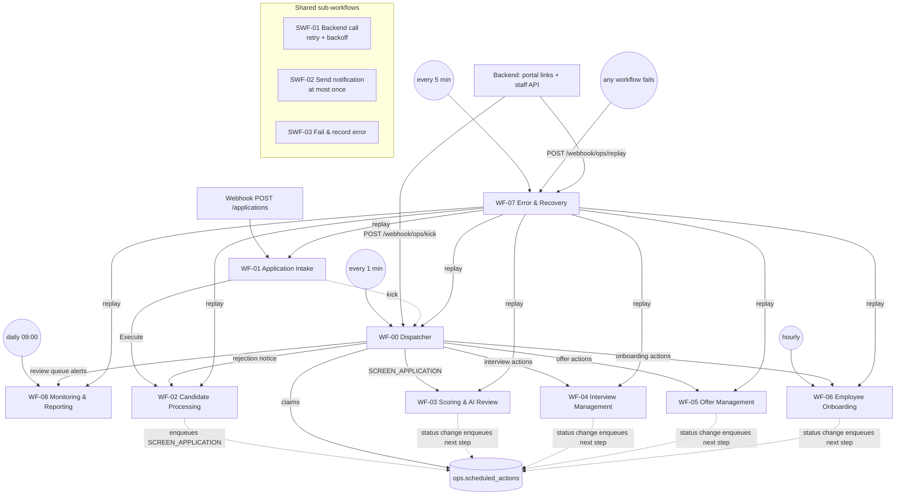

# n8n workflows and responsibilities

Ten workflows plus three reusable sub-workflows. Each one has a single responsibility, is short-lived, and
talks to the database **only** through `api.*` functions (Postgres node, parameterised queries).



## Conventions every workflow follows

1. **Context first.** The first node (Set, "ctx") builds the execution context passed to every `api.*` call:
   ```json
   { "actor_type": "SYSTEM", "actor_id": "n8n", "workflow_name": "WF-03", "workflow_version": "1.0.0",
     "execution_id": "{{ $execution.id }}", "correlation_id": "{{ $json.correlation_id }}" }
   ```
2. **Execution tracking.** The workflow starts with `SELECT api.start_workflow_execution($1::jsonb, 'WEBHOOK'|'SCHEDULE'|'SUB_WORKFLOW'|'REPLAY')`
   and ends with `api.finish_workflow_execution($1::jsonb, 'SUCCEEDED')`. The error branch calls SWF-03, which
   records the error and finishes the execution as `FAILED`.
3. **Settings → Error workflow = WF-07** on every workflow. This is the safety net for unexpected crashes.
4. **Database access.** Use the Postgres node with query parameters (`$1, $2`) and never interpolate
   candidate data into SQL. Use the `NovaTech DB (n8n_app)` credential.
5. **Backend access.** Always go through **SWF-01** (it owns the base URL, auth header, retries, and the
   `X-Correlation-ID` / `X-Attempt` headers).
6. **Messages.** Always go through **SWF-02** with a deterministic dedupe key (e.g. `interview.invite:<interview_id>`).
7. **No business thresholds in IF/Switch nodes.** Branch on values returned by the backend or the database.
   Code nodes stay under about 30 lines; anything larger belongs in the backend.
8. **Delayed work re-checks state.** Timer handlers read `api.application_snapshot()` (or the entity row) first,
   and complete the action as `SKIPPED` if the precondition no longer holds.

## Sub-workflows

### SWF-01 Backend call (retry with exponential backoff)
* **Trigger:** When Executed by Another Workflow. Inputs: `method`, `path`, `body`, `correlation_id`,
  `fault_inject` (optional, tests only), `max_attempts` (default 3), `ctx`.
* **Steps:**
  1. Loop: set `attempt`.
  2. HTTP Request to `http://backend:8000{path}` with header auth `X-API-Key`, headers `X-Correlation-ID`,
     `X-Attempt` and `X-Fault-Inject`. Settings: *Never error*, *Include response status*, timeout 90 s.
  3. Classify the result:
     * 2xx: success.
     * Body `retryable: true`, a 5xx status, or a network/timeout error: retryable.
     * Anything else: permanent.
  4. On a retryable failure with `attempt < max_attempts`: `api.log_action(... 'RETRY_ATTEMPT' ...)`,
     wait `2^attempt` seconds, then loop.
  5. On success with `attempt > 1`: `api.log_action(... 'RETRY_RECOVERED' ...)`.
* **Output:** `{ ok, status, body, attempts, error_class, error_code }`. It never throws, so callers decide
  (fallback, error queue, and so on).

### SWF-02 Send notification (at most once)
* **Inputs:** `dedupe_key`, `channel` (EMAIL | TELEGRAM), `template_key`, `recipient`, `subject`, `body`,
  `application_id`, `entity_type`, `entity_id`, `ctx`.
* **Steps:**
  1. `api.begin_notification(...)`. If `should_send = false`, return (a replay already sent it).
  2. Send via the Gmail or Telegram node (retry on fail: 3).
  3. `api.finish_notification(id, 'SENT'|'FAILED', provider_message_id, error)`.
* Swapping Gmail for Outlook, SES or Slack for another company changes **only this sub-workflow**.

### SWF-03 Fail & record error
* **Inputs:** `ctx`, `node_name`, `error_class`, `error_code`, `error_message`, `http_status`, `retry_count`,
  `entity_type`, `entity_id`, `payload`, `replay_workflow`.
* **Steps:**
  1. `api.record_error(...)`, which dedupes by fingerprint.
  2. `api.finish_workflow_execution(ctx, 'FAILED', error_id)`.
  3. Optional immediate Telegram alert for `NON_RETRYABLE` errors.

## Workflows

### WF-00 Dispatcher & scheduler
| | |
|---|---|
| Responsibility | Deliver outbox events and fire due timers exactly where they belong |
| Triggers | Schedule (every minute, the safety net); webhook `POST /webhook/ops/kick` (header auth; the backend calls it right after a person acts); Execute Workflow (WF-01 kicks it after intake) |
| Steps | 1. `api.claim_scheduled_actions(worker, 25, 300)`<br/>2. **Route by Action Type**: a routing table (action type → owning workflow) sends each action to WF-02, WF-03, WF-04, WF-05, WF-06 or WF-08 with `{action}`<br/>3. `api.complete_scheduled_action(id, 'DONE'\|'SKIPPED'\|'FAILED', result, error, ctx)` |
| Reliability | `SKIP LOCKED` makes overlapping runs safe. A failed action is retried with backoff (30 s, 1 m, 2 m, … up to 1 h). After `max_attempts` it goes to the error queue (`ACTION_ATTEMPTS_EXHAUSTED`, replayable). Expired leases are re-claimed. An unknown action type fails visibly ("no handler registered") instead of being dropped. |
| Owns transitions | none (routing only) |
| Source | `n8n/src/wf-00-dispatcher-scheduler.mjs` (`ROUTES` is the routing table) |

### WF-01 Application intake
| | |
|---|---|
| Responsibility | Accept a submission durably, assign the correlation id, validate and normalise |
| Triggers | Webhook `POST /webhook/applications` (header `Idempotency-Key` required). WF-07 replays failed intakes through the same webhook with the original key. |
| Steps | 1. ctx + `start_workflow_execution`<br/>2. Missing `Idempotency-Key` → 400<br/>3. `api.register_event('WEB_FORM', key, 'APPLICATION_SUBMITTED', body)`<br/>4. Replay of a completed event → respond 200 with the stored result and stop<br/>5. Respond **202** `{correlation_id}`<br/>6. SWF-01 `POST /v1/intake/validate`<br/>7. Execute WF-02 `{event_id, correlation_id, validation}`<br/>8. Kick WF-00 (screening starts within seconds) |
| Failure | Backend unavailable after retries → `api.fail_event` + SWF-03 with `replay_workflow = 'WF-01'` and payload `{source, idempotency_key, body}` |
| Owns transitions | none (WF-02 persists) |

### WF-02 Candidate processing
| | |
|---|---|
| Responsibility | Persist the candidate and application, detect duplicates, and keep the candidate informed: acknowledgement, rejection notice, and a status update at every other candidate-facing step |
| Triggers | Execute Workflow (from WF-01, or WF-07 replay); WF-00 actions `SEND_REJECTION_NOTICE` and `NOTIFY_CANDIDATE` |
| Steps | 1. `api.submit_application(event_id, validation, ctx)`<br/>2. Acknowledgement by outcome (SWF-02, key `candidate.ack:<event_id>`): received, duplicate ("we already have your application"), or invalid (what was missing), when a valid email exists<br/>3. Rejection notice (key `candidate.rejection:<application_id>`) after re-checking the application is still `REJECTED`<br/>4. Status update (key `candidate.update:<application_id>:<history_id>`): the database queues `NOTIFY_CANDIDATE` with the status change when the new status has a `candidate_notice` (under review, interview completed, selected, onboarding finished, withdrawn). Skipped if a later step has already emailed the candidate (`candidate_informed`), so emails never arrive out of order. Internal reasons are never part of the email. |
| Owns transitions | NEW → VALIDATING → VALIDATED / SCREENING_REVIEW |

### WF-03 Scoring & AI review
| | |
|---|---|
| Responsibility | Data-driven rule score, advisory AI analysis, screening decision |
| Trigger | WF-00 action `SCREEN_APPLICATION` |
| Steps | 1. `api.application_snapshot` → status must be `VALIDATED`, else SKIPPED<br/>2. SWF-01 `/v1/screening/score` → `api.record_application_score`<br/>3. SWF-01 `/v1/screening/ai-analysis` → `api.record_ai_analysis`. If the call fails after retries, build a `FALLBACK` analysis with the error as reason (the candidate goes to review; the error is queued).<br/>4. SWF-01 `/v1/screening/decide` → `api.apply_screening_decision` |
| Failure | `NO_ACTIVE_RULES` → `api.transition_application_status(VALIDATED → SCREENING_REVIEW, SYSTEM)` |
| Owns transitions | VALIDATED → SCORED → SHORTLISTED / SCREENING_REVIEW / REJECTED |

### Shape of WF-04, WF-05, WF-06 (dispatcher handlers)
Each handler has one trigger (`action` from WF-00) and the same skeleton, generated by `n8n/src/lib.mjs`:

```
Build Context → Start Log & Load State (one query: execution log + snapshots + settings) → Route by Action Type
   each branch:  re-check state ──no──→ Skip: No Longer Applies ─────────────────────┐
                  │yes                                                              ├→ Finish & Return
                  └→ api.* write / SWF-01 call → OK? → SWF-02 email(s) → Result ────┘   {action_outcome, action_reason}
   failures:      SWF-01 error RETRYABLE → Result: Retry Later (FAILED → dispatcher backoff)
                  anything else (DB rule violation, 4xx) → SWF-03 → Result: Moved to Error Queue (DONE, error_id)
```

The error-queue entry stores `{action}` and `replay_workflow`, so WF-07 can re-run the same branch. Every email has a
deterministic dedupe key, so a retried or replayed branch never sends a message twice.

### WF-04 Interview management
| | |
|---|---|
| Responsibility | Invitation, slot booking follow-up, calendar event, reminders, feedback collection, evaluation |
| Triggers | WF-00 actions `INVITE_TO_INTERVIEW`, `INTERVIEW_INVITE_REMINDER`, `INTERVIEW_INVITE_EXPIRY`, `FINALIZE_INTERVIEW_BOOKING`, `FEEDBACK_REMINDER`, `FEEDBACK_ESCALATION`, `EVALUATE_INTERVIEW`, `SEND_MEETING_DETAILS` |
| Invite | `api.create_interview_invitation` (idempotent per round): generates the interviewer's slots from their weekly hours, sets the response deadline (`interviews.respond_by`: midnight after `interview.invite_expires_after`, moved out until the candidate can choose from `interview.min_choice_days` days), copies the meeting details entered at shortlisting, schedules the reminder (at the latest a day before the deadline) and the expiry (at the deadline) → signed slot link (`POST /v1/links`, purpose `INTERVIEW_SLOT`, expires with the invitation) → email (`interview.invite:<interview_id>`, "choose a time before <day>"). Only slots on days before the deadline are offered or bookable |
| Reminder / expiry | Reminder only while the interview is still `INVITED`. Expiry: `api.expire_interview_invitation` → back to `SCREENING_REVIEW` (the recruiter is alerted by WF-08) |
| Booking | The candidate picks a slot in the portal (`POST /v1/portal/interview/confirm` → `api.confirm_interview_slot`: books the slot, cancels the invitation timers, schedules the feedback timers). WF-04 then records the calendar event id, emails the candidate (time in company time zone, the meeting link, meeting ID and passcode or the on-site instructions, add-to-calendar link; meeting details are never shown before the booking) and sends the interviewer a scorecard link (purpose `INTERVIEW_FEEDBACK`). The brief includes 5 **AI-drafted interview questions** (Basic LLM Chain + Mistral Cloud Chat Model `ministral-8b-latest`, n8n credential `Mistral AI (n8n)`; only the role, declared skills and screening notes are sent; the brief goes out without them if the model fails) |
| Meeting changes | Staff set the meeting when they shortlist (required) or later on the application page (`POST /v1/staff/applications/{id}/meeting` → `api.set_interview_meeting`). If the candidate has already booked, `SEND_MEETING_DETAILS` emails the candidate and the interviewer the new details |
| Feedback | Reminder to the interviewer, then escalation to HR, both only while feedback is missing. Submitting the scorecard (interviewer: `POST /v1/portal/feedback`; HR in the portal: `POST /v1/staff/interviews/{id}/feedback`, both → `api.submit_interview_feedback`) cancels both |
| Evaluation | 1. SWF-01 `POST /v1/interviews/ai-assessment`: Mistral reads the ratings, the interviewer's comments and the screening results (names and contact details removed) and returns SELECT / REVIEW / REJECT plus whether the comments support the ratings (ALIGNED / PARTIAL / CONTRADICTORY); validated, one corrective retry, FALLBACK otherwise<br/>2. `api.record_interview_assessment`<br/>3. SWF-01 `POST /v1/interviews/evaluate`: weighted final score (30 % screening + 70 % interview); the interviewer's recommendation and the AI assessment can only send a case to hiring-manager review (AI unavailable, AI disagrees, or comments contradict the ratings)<br/>4. `api.apply_interview_decision` |
| Owns transitions | SHORTLISTED → INTERVIEW_SCHEDULED → INTERVIEWED → SELECTED / REJECTED / INTERVIEW_REVIEW; SHORTLISTED → SCREENING_REVIEW (expiry) |

### WF-05 Offer management
| | |
|---|---|
| Responsibility | Offer draft, one or two approval levels, PDF letter, sending, reminders, expiry, negotiation and closure |
| Triggers | WF-00 actions `PREPARE_OFFER`, `REQUEST_OFFER_APPROVAL`, `SEND_OFFER`, `OFFER_REMINDER`, `OFFER_FINAL_REMINDER`, `OFFER_EXPIRY`, `NOTIFY_NEGOTIATION`, `NOTIFY_OFFER_CLOSED` |
| Draft | `api.create_offer` (salary = expected salary clamped to the position band; two levels when above `offer.second_approval_threshold`). After an approver rejection the system never re-drafts on its own: HR is asked to revise |
| Approval | A signed approval link (purpose `OFFER_APPROVAL`, 7 days) goes to the reporting manager if eligible at that level, otherwise to the first eligible approver; any eligible approver can still decide. Level 1 belongs to the approvers of the offer's department (or the hiring/reporting manager), level 2 to any `APPROVER_L2`. The database enforces L1 before L2, a different person per level and never the creator whenever another approver is available (a single approver, e.g. HR only, may approve; the waiver is audited), and a reason on rejection. No eligible approver → error queue (`NO_APPROVER_AVAILABLE`) |
| Send | SWF-01 `POST /v1/offers/document` (deterministic PDF, stored by offer code and revision) → `api.mark_offer_sent` (schedules reminders and expiry) → signed response link (purpose `OFFER_RESPONSE`, expires with the offer) → email |
| Response | Candidate accepts / declines / asks to negotiate in the portal (`api.respond_to_offer`, cancels the reminders). Negotiation notifies HR and the manager and acknowledges the candidate; a decline or expiry notifies both sides |
| Owns transitions | SELECTED → OFFER_PENDING_APPROVAL → OFFERED → ACCEPTED / DECLINED / NEGOTIATION / OFFER_EXPIRED |

### WF-06 Employee onboarding
| | |
|---|---|
| Responsibility | Create the employee exactly once; tasks, account (simulated), welcome, orientation, overdue tracking |
| Triggers | WF-00 actions `START_ONBOARDING`, `NOTIFY_ONBOARDING_COMPLETE`; schedule every hour (minute 15) |
| Start | `api.create_employee_from_offer` (one employee per offer: `NT-YYYY-NNN`, company email, tasks from templates with owners and due dates) → simulated account provisioning (`api.mark_account_provisioned`; replace with Google Workspace / Entra ID) → welcome email with orientation and add-to-calendar link → notice to HR, the manager and IT with the task list |
| Overdue sweep | `api.claim_overdue_onboarding_tasks` claims each overdue task at most once per `onboarding.overdue_reminder_every` → one reminder to its owner (HR as fallback). Nothing to do → no execution log entry |
| Completion | The last task done moves the application to `ONBOARDED`; WF-06 tells HR and the manager |
| Owns transitions | ACCEPTED → ONBOARDING (→ ONBOARDED via `api.complete_onboarding_task`) |

### WF-07 Error & recovery
| | |
|---|---|
| Responsibility | Safety net, alerting, operator replay |
| Triggers | Error Trigger (it is the error workflow of every other workflow); schedule every 5 minutes; webhook `POST /webhook/ops/replay` (header auth; the backend calls it for `POST /v1/staff/errors/{id}/replay`) |
| Crash | `api.record_error` (class `UNKNOWN`, code `WORKFLOW_CRASHED`, deduplicated by fingerprint) and the crashed run is closed as FAILED in the execution log |
| Digest | `api.claim_unalerted_errors` → one email to `ops.alert_email` listing every new error (each error is alerted once) |
| Replay | `api.begin_error_replay(error_id)` (OPEN → REPLAYING, records who replayed) → by `replay_workflow`: WF-00 requeues the scheduled action; WF-01 re-submits through the intake webhook with the original idempotency key; WF-02 re-persists the stored validation; WF-03 / 04 / 05 / 06 / 08 re-run the stored `{action}` → `api.resolve_error(RESOLVED \| OPEN)` → HTTP 200 with the outcome (409 if the error is not replayable) |
| Why replay is safe | Replays reuse the original idempotency key and entity ids, and every handler re-checks state first, so no `api.*` call on the path can create a duplicate |

### WF-08 Monitoring & reporting
| | |
|---|---|
| Responsibility | Daily management report, review-queue alerts |
| Triggers | Schedule daily 09:00 (workflow time zone Asia/Karachi); webhook `POST /webhook/ops/daily-report` (header auth; body `{"report_date": "YYYY-MM-DD", "force": false}`); WF-00 action `NOTIFY_REVIEW_QUEUE` |
| Report | `reporting.daily_metrics(date)` (default yesterday) → SWF-01 `POST /v1/reports/daily-summary` (template text, or AI prose that is rejected if it contains any number not in the metrics) → `api.save_daily_report` (one per date) → email to HR admins and L2 approvers (`report.daily:<date>`) → `api.mark_daily_report_delivered`. Already delivered → SKIPPED unless `force` |
| Review alerts | Re-checks the application is still in `SCREENING_REVIEW` / `INTERVIEW_REVIEW` → email to the recruiters, or to the position's hiring manager for interview reviews, with the reason and the scores |
| Rule | Every number comes from SQL. AI only writes prose. |

### WF-09 Notification API
| | |
|---|---|
| Responsibility | Let the backend send a one-off message (staff sign-in links) without knowing the mail provider |
| Trigger | Webhook `POST /webhook/ops/notify` (header auth) with `dedupe_key`, `template_key`, `recipient`, `subject`, `html` |
| Steps | Validate (one address, lower.dot_case template key, non-empty subject and body; otherwise 400) → SWF-02 → `{status, duplicate_suppressed}` |
| Why | SWF-02 stays the only place that knows the mail credential, and every message is recorded in `ops.notifications` and sent at most once |

## Brief scenario coverage

| # | Scenario | Where it is proven |
|---|---|---|
| 1 | Strong candidate becomes an employee | WF-01…06 happy path |
| 2 | Incomplete application → manual review with reason | validator `NEEDS_REVIEW` → `VALIDATING → SCREENING_REVIEW` |
| 3 | Duplicate candidate submission detected | `submit_application` → `DUPLICATE` |
| 4 | Same webhook replayed, no duplicates | `register_event` replay + `submit_application` idempotency |
| 5 | Weak candidate rejected by rules | scoring `REJECT` + policy |
| 6 | Rule changed in DB is used without editing workflows | rules read per request; version bump trigger |
| 7 | AI malformed output handled | `X-Fault-Inject: ai:malformed` → one retry → `FALLBACK` → review |
| 8 | Retryable failure succeeds after retries | `X-Fault-Inject: score:http_503@2` → SWF-01 recovers |
| 9 | Non-retryable failure → error queue | `X-Fault-Inject: score:http_400` → SWF-03 |
| 10 | Retries exhausted → dead queue | `X-Fault-Inject: score:http_503` (every attempt) |
| 11 | Corrected item replayed without duplicates | WF-07 replay |
| 12–14 | Interview reminders / cancellation / feedback reminder | timers in `ops.scheduled_actions` (WF-04) |
| 15 | Candidate fails the interview | `apply_interview_decision` |
| 16–18 | Standard / two-level / rejected approval | WF-05 + `offer_approvals` constraints |
| 19–21 | Decline / negotiate / expire | `respond_to_offer`, `expire_offer` |
| 22 | Onboarding exactly once | `employees.offer_id` unique + idempotent function |
| 23 | Overdue onboarding task visible | `reporting.v_overdue_onboarding_tasks`, daily metrics |
